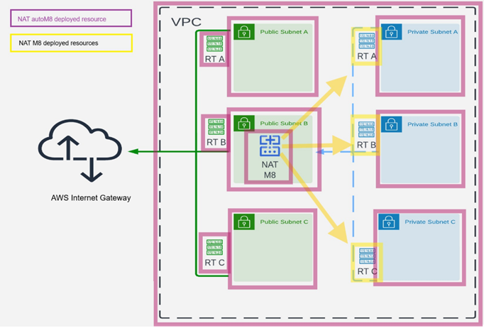

# NATM8 and NATautoM8 FAQ 

### What is NAT M8?
> NAT M8 is an Infrastructure-as-Code (IaC) solution designed to provide network address translation services within AWS environments. It offers cost-effective and high-availability NAT capabilities for private AWS services.

### What is NAT autoM8?
> At its core, NAT autoM8 is your cloud’s network orchestrator —a tool that builds and automates your AWS VPC structure with the ease and efficiency of setting up a home Wi-Fi router. 
It creates a brand new VPC, configures everything from subnets to route tables and associations and deploys NAT M8 service.
It is an Infrastructure-as-Code (IaC) solution designed to provide network address translation services within AWS environments. It offers cost-effective and highly available NAT capabilities for private AWS services. 

### How does NAT autoM8 differ from NAT M8?
> While NAT AutoM8 configures the virtual private cloud and all components (purple), NAT M8 (yellow) dynamically routes traffic by configuring and updating route tables and performing the network address translation from your private network to the Internet. 

### Which NAT M8 should I use for my environment?
<table border="1" cellpadding="5" cellspacing="0" style="border-collapse: collapse; width: 100%;">
    <thead>
        <tr>
            <th style="border: 1px solid black;">Conditions</th>
            <th style="border: 1px solid black;">Recommended tool</th>
            <th style="border: 1px solid black;">Deployment</th>
        </tr>
    </thead>
    <tbody>
        <tr>
            <td style="border: 1px solid black;">Brand new environment</td>
            <td style="border: 1px solid black;">NAT autoM8</td>
            <td rowspan="2" style="border: 1px solid black;">Go to your AWS Console  
            Serverless Applications Repository => Available applications, click <i>"Show apps that create IAM..."</i>  
            Search NAT autoM8 
            For details on each parameter check the Readme. 
             
            
         
</td>
        </tr>
        <tr>
            <td style="border: 1px solid black;">Existing system – parallel setup</td>
            <td style="border: 1px solid black;">NAT autoM8</td>
        </tr>
        <tr>
            <td style="border: 1px solid black;">NAT GW already set up</td>
            <td style="border: 1px solid black;">NAT M8 (drop-in replacement)</td>
            <td rowspan="2" style="border: 1px solid black;">
                <strong>Recommended method: Via AWS Serverless Repository:  
1.	Go to your AWS Console  
2.	Serverless Applications Repository => Available applications, click <i>"Show apps that create IAM..."</i>   
3.	Search NAT M8     
</strong>
<strong>The manual method for additional customisation or if your AWS Region doesn’t have a Serverless Application Repository:  
1.Download NATM8.json from this repository to your machine, then open the AWS console CloudFormation. 
2.Upload the template and follow the guided steps.   
<b>For more detailed instructions, refer to the <a href="ManualDeploymentGuide.md" target="_blank">Manual Deployment Guide</a>.</b>
</strong>
            </td>
        </tr>
        <tr>
            <td style="border: 1px solid black;">Existing system – full revamp</td>
            <td style="border: 1px solid black;">NAT M8 (you manually make the changes to your own environment)</td>
        </tr>
    </tbody>
</table>

### How does NAT M8 differ from AWS NAT Gateway?
> NAT M8 offers significant cost savings compared to AWS NAT Gateway, with pricing that can be up to 97.3% cheaper. Additionally, NAT M8 compute engine (EC2) boasts a higher SLA (99.99%) and automatic failover capabilities for improved availability.

### What AWS regions and instance types does NAT M8 support?
> NAT M8 is compatible with various AWS regions and instance types. However, specific availability may vary, so it is recommended that you check the AWS documentation for the most up-to-date information on supported instance types and Serverless Application Repository availability on your region.

### How does NAT M8 ensure security for network traffic?
> NAT M8 uses the latest Amazon Linux 2023 image with all security updates applied at boot time. Additionally utilises [Fail2ban](https://en.wikipedia.org/wiki/Fail2ban) software framework and kernel level firewall. Further more it includes customisable security configurations, logging, and monitoring features.

### Does NAT M8 support compliance with data privacy regulations?
> NAT M8, which is deployed and configured locally, does not send usage reports or has other external connectivity. As a standard Linux-based solution, it can be extended or integrated into any monitoring or other security system.

### What happens in case of instance or availability zone failures?
> In case of an instance failure the instance is automatically replaced within minutes. In the event of a zone outage the traffic is routed to the instanc(es) in functioning availability zone(s). 

### How does NAT M8 handle scalability?
> NAT M8 seamlessly scales from small to large deployments, automatically adjusting to accommodate changes in workload and network demands. Whether you have two public and two private subnet or a more complex network setup, NAT M8 can adapt accordingly.

### Does NAT M8 require any special configurations or setup?
> Setting up NAT M8 is straightforward and can be easily integrated into existing AWS environments. Our documentation provides step-by-step instructions to help you get started quickly.

### What support options are available for NAT M8 users?
> NAT M8 offers various support options to meet the needs of our users. This includes documentation, tutorials, and community forums.