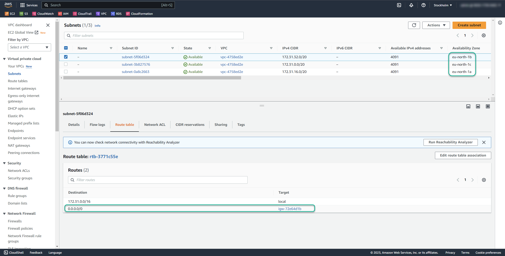
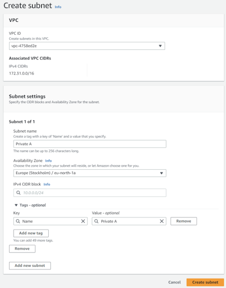
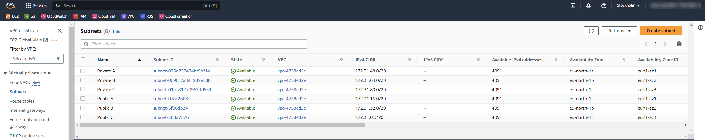

# :book: NAT M8 Deployment Guide for Manual Deployment  

# Overview
This guide walks you trough the manual configuration steps of the VPC and how to deploy NAT M8 Cloudformation stack. 

---
## Prerequsite subnet configuration
On AWS console, search for VPC and open subnets option. 
A typical new accounts networking configuration looks like this:

Take note of route table having default route (0.0.0.0/0) pointing to IGW-XXX, that is the AWS Internet Gateway. 

Start by clicking on the name of the first subnet. On the right side, check which Availability Zone it belongs to, and then add a descriptive name, such as "Public B." Repeat this process for the other subnets. Clearly annotating the subnets will be helpful during the deployment phase. 

If you already have private subnets, you can skip the next step. Otherwise, click the "Create Subnet" button in the top right corner. Fill in the parameters, such as subnet name and availability zone, accordingly. For the IPv4 CIDR block, we recommend using a /20 subnet mask. The values for the three subnets are as follows: 172.31.48.0/20, 172.31.64.0/20, and 172.31.80.0/20. For additional options, you can use a subnet calculator such as https://www.calculator.net/ip-subnet-calculator.html. 

The final configuration should look like this: 

---
## Deployment 

First, download the file NATM8.json from the repository to your machine. Then, open the AWS Management Console, navigate to CloudFormation, and click on "Create Stack." Choose the option to "Upload a template file" and select the NATM8.json file you just downloaded.  

You only need to fill in the first four parameters with your local settings, making sure to label the subnets appropriately. For the remaining parameters, you can either keep the default settings or modify them according to your needs. 

---
## Parameter reference 

### :cloud: Virtual Private Cloud Settings
Parameters consist of straightforward, generic network information for your environment. For further details on the technology, please refer to the [AWS documentation](https://docs.aws.amazon.com/vpc/latest/userguide/what-is-amazon-vpc.html).

### Instance Generic Settings

#### Instance Type X64
The EC2 instance types for X64 (Intel/AMD) architecture follow the format x.<size>, y.<size>, z.<size>. You can specify a maximum of 3 X64 types, or leave it empty if you only intend to use ARM type instances. Ensure that the instance types are available in the selected region, and avoid mixing instances with different CPU architectures, as this will cause the deployment to fail. 

#### Instance Type ARM
The EC2 instance types for ARM architecture follow the format x.<size>, y.<size>, z.<size>. You can specify a maximum of 3 ARM types or leave it empty if you only intend to use X64 type instances. Make sure the instance types are available in the selected region, and avoid mixing instances with different CPU architectures to prevent deployment failure. 

#### Desired Number of Instances
Specify the desired number of instances. If no scale-up or scale-down configuration is set, this number will remain as specified. Otherwise, the number may increase or decrease accordingly. 

#### Instance Minimum Number
Set the minimum number of instances. If this is set to 0 and a scale-down configuration is present, the instance will stop by default once applicable conditions are met (default is 1MB/hour). To maintain a continuously running service, set the minimum number to 1. 

#### Instance Scale-Up Configuration
The first parameter is the CPU usage percentage (range of 1-100), and the second is the number of minutes (minimum value of 5 and maximum of 1440). By default, if the average CPU usage per instance exceeds 70% for 5 minutes, a new instance will be scaled up until the ASG maximum number is reached. Leave it empty if no scale-up is desired. 

#### Instance Scale-Down Configuration
The first parameter is network traffic in MB (minimum value of 1), and the second is the number of minutes (minimum value of 5 and maximum of 1440). By default, if the network traffic usage per instance is below 1MB for 60 minutes, the instance will be scaled down until the ASG minimum number is reached. Leave it empty if no scale-down is desired. 

### Advanced Configuration

#### CloudWatch Logs and Metrics Configuration

The configuration options for collecting logs and metrics are set in the SSM Parameter Store at /NAT_M8/CloudwatchLogsConfig<type>. For a development or hobbyist environment, the "minimal" configuration is suggested. For standard environments, the "basic" configuration is recommended, while for enterprise or critical environments, the "standard" configuration is ideal. 

Here are the differences between the configurations: 

Minimal: Only log files are collected. 

Basic: In addition to the minimal collection, essential disk and memory metrics are gathered. 

Standard: This extends the basic configuration by including additional memory and disk metrics, such as I/O. 

All collected metrics can be viewed under the "All Metrics" section in the CWAgent category. Please note that adding extra monitoring incurs a cost per metric/host, as outlined in the <a href="https://aws.amazon.com/cloudwatch/pricing/" target="_blank">CloudWatch pricing details</a>. 

#### OnDemand Instance Purchase Percentage
The percentage of ondemand instances in the autoscaling group is indicated as follows: at 0%, all instances are spot, and at 100%, all are ondemand. For a setting of 3 instances, 33% means 1 will be ondemand and 2 will be in spot purchase mode. 

#### Scheduled Scale Down State
By default, the scheduled scale-down feature is disabled. If you require this feature, follow these steps: 

1. Configure Parameters in Parameter Store: Set the parameters using the keys `/NAT_M8/ASGScaleDownConfig/*`. Replace the asterisk (*) with the following keys: 

   - `DesiredCapacity` 

   - `MinimumCapacity` 

   - `Schedule` 

   - `TimeZone` 

The `DesiredCapacity` and `MinimumCapacity` are straightforward numerical values. Scheduling follows Cron syntax; for example, "0 22 * * 1-5" means the scale-down will occur at 10:00 PM from Monday to Friday. For other scheduling combinations, please refer to https://crontab.cronhub.io/. The default TimeZone is UTC, but if you prefer a different one, consult the <a href="https://docs.aws.amazon.com/AWSCloudFormation/latest/UserGuide/aws-resource-autoscaling-scheduledaction.html#cfn-autoscaling-scheduledaction-timezone" target="_blank">AWS documentation</a> for the appropriate syntax. 

2. Enable the Feature: After configuring the necessary parameters in the parameter store as outlined above, set the corresponding CloudFormation parameter to enable this feature. 

#### Scheduled Scale Up State
By default, scheduled scaling up is disabled. If this feature is required, please follow these steps: 

1. Configure the parameters in the parameter store using the keys `/NAT_M8/ASGScaleUpConfig/*`. Use the same syntax and logic as for scaling down. 

2. After configuring the necessary parameters in the parameter store as mentioned above, set this CloudFormation parameter to "enabled." 

### Other Settings

#### NAT Configuration Bucket
This field is optional. If left empty, the route configuration script will be downloaded directly from GitHub. If you prefer to source it from a local bucket, specify only the bucket name (e.g., "mybucket") without any leading or trailing slashes "**/**".   

#### NAT Routing Logic location
This field is also optional. If left empty, the route configuration script will be downloaded from GitHub. If you want to source it from a local bucket and the file is located in the root directory, specify "ConfigureRoutes.ps1". If the file is located in a nested subfolder, such as "scripts/nat", provide the path like this: "scripts/nat/ConfigureRoutes.ps1". Please note that there should be no "/" at the beginning of the filename.   

#### Instance AMI ID X64 and Instance AMI ID ARM

These are <a href="https://docs.aws.amazon.com/AWSCloudFormation/latest/UserGuide/parameters-section-structure.html#aws-ssm-parameter-types" target="_blank">SSM parameter types</a> that <a href="https://aws.amazon.com/blogs/compute/query-for-the-latest-amazon-linux-ami-ids-using-aws-systems-manager-parameter-store/" target="_blank">dynamically reference</a> the latest version of the respective AMI ID for the region. This means that upgrading the AMI is as simple as periodically updating the stack with a new submission.   

---
## Removing NAT M8 components 
1. Ensure that no instances are running and that the Auto Scaling Group (ASG) is set to 0/0/0.   

2. Open the VPC console, navigate to the route tables section, and starting with the route table named "Private route 2 NAT 1," edit the subnet associations by removing all associations.   
3. Finally, go to CloudFormation and delete the stack.   

