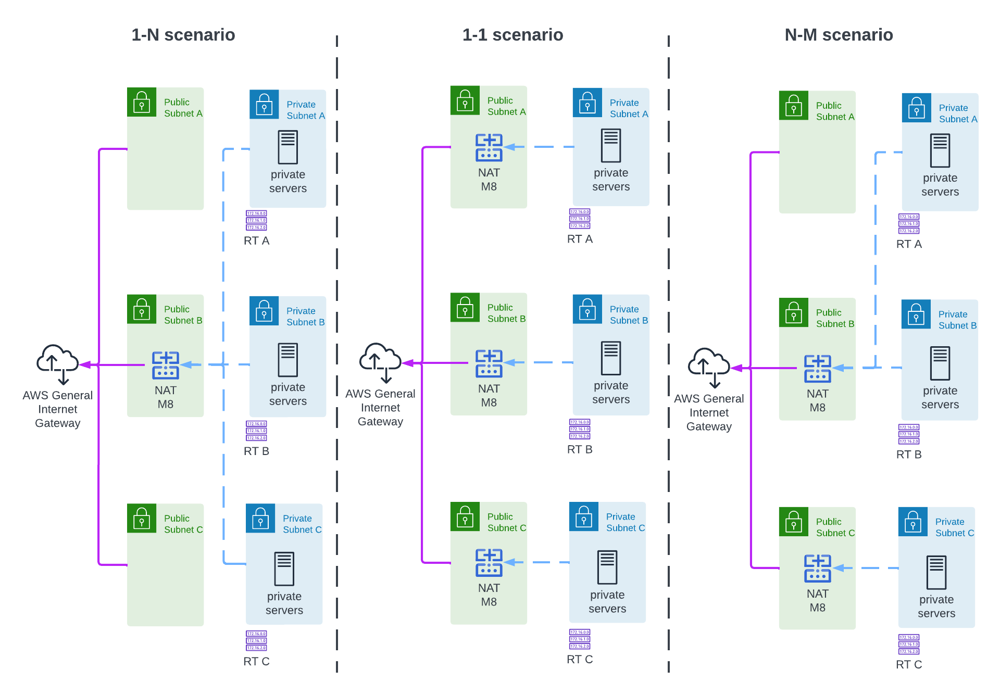
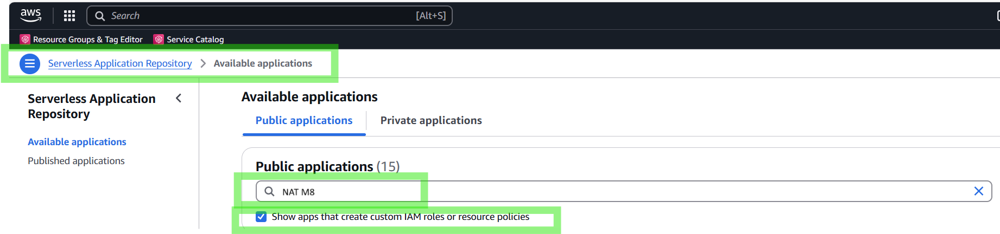
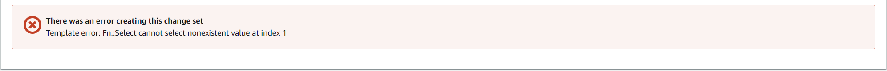
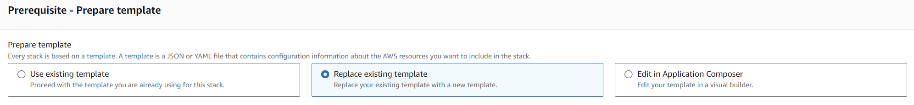

# The One-step AWS Network Orchestrator

Managing cloud networks and keeping everything connected can be a bit of a headache. Traditional tools like AWS NAT Gateway can cost you $40 a month or more, and you have to tinker for hours with the right setup to get started.

Say hello to **NAT autoM8** and **NAT M8** and Make cloud networking a breeze: cheaper, quicker, and way easier to use.

At its core, **NAT autoM8 is your cloud’s network orchestrator** — *a tool that builds and automates your AWS VPC structure with the ease and efficiency of setting up a home Wi-Fi router*. It configures everything from subnets to route tables and associations and deploys **NAT M8**, *a super cost-effective and reliable NAT service that delivers seamless internet access to your private AWS systems*.

NAT autoM8 is a fully IaC (Infrastructure-as-Code) solution, ideal for hobbyists and businesses looking to optimise their cloud infrastructure while keeping costs low. It’s licensed under the **NATM8 Public Licence**, ensuring source-available transparency.

### 🎥 The One-Step AWS Network Orchestrator | Simplify Cloud Networking with NAT autoM8 & NAT M8   
<small>*click image to [open video](https://www.youtube.com/watch?v=kX5Ojo4cvGQ)*</small>

## :twisted_rightwards_arrows: Why Switch to NAT autoM8: The Smarter Choice for AWS Connectivity
NAT autoM8 offers a compelling combination of cost efficiency, reliability, and scalability, making it the ideal choice for businesses optimising their AWS connectivity. Below is a clear comparison of its benefits and the reasons to switch:

<table>
<thead>
	<tr>
		<th>Feature</th>
		<th>Benefit</th>
		<th>Reason to Switch</th>
	</tr>
</thead>
<tbody>
	<tr>
		<td>Cost Efficiency</td>
		<td>Runs for just <b>$1 per month</b> compared to AWS NAT Gateway’s <b>$40+ per month</b>.</td>
		<td>Save 97.3% compared to NAT Gateway using a t4g.nano spot instance.</td>
	</tr>
	<tr>
		<td>Zero Data Transfer Fees</td>
		<td>NAT Gateway charges $59/TB/month, while NAT M8 has no datatransfer costs.</td>
		<td> No "hidden" fees.</td>
	</tr>
	<tr>
		<td>Superior Reliability</td>
		<td>NAT M8’s compute engine (EC2) has a 10X better reliability (<a href="https://aws.amazon.com/compute/sla/">99.99</a>  vs <a href="https://aws.amazon.com/vpc/sla/">99.9</a> SLA) compared to NAT Gateway.</td>
		<td>Enhanced uptime minimises disruptions and ensures stability for critical operations.</td>
	</tr>
	<tr>
		<td>Fast Automatic Failover</td>
		<td><b>Automatic</b> failover occurs in under 1 minute.</td>
		<td>NAT Gateway may require hours of manual intervention or AWS support, increasing downtime disruption.</td>
	</tr>
	<tr>
		<td>Dynamic Scalability</td>
		<td>Automatically adjusts from 2 public/2 private subnet to 8/8. See a few examples below!</td>
		<td>Effortlessly scale your network without additional complexity or cost.</td>
	</tr>
</tbody>
</table>

NAT autoM8 combines these benefits into a single, adaptive solution. It’s not just an alternative to NAT Gateway—it’s a smarter, forward-thinking choice. 

## :office: Who Can Benefit Most from NAT autoM8?
* **Startups** looking to maximise the value of every dollar while scaling.
* **Enterprises** seeking to optimise cloud costs with improving reliability of their environment.
* **Engineers or Developers** who need intermittent or time-boxed (9-5) NAT service.

# :checkered_flag: Get Started
*Ready to simplify and radically lower your cloud network costs?*   
  
Let NAT autoM8 and NAT M8 handle the heavy lifting while you focus on getting the most out of your systems.

**Your AWS setup just became smarter, cheaper, and more reliable.** 

## :white_check_mark: Prerequisite
Account-level AWS administrator access (or similar) 

## :feet: Deployment Steps
<table border="1" cellpadding="5" cellspacing="0" style="border-collapse: collapse; width: 100%;">
    <thead>
        <tr>
            <th style="border: 1px solid black;">Conditions</th>
            <th style="border: 1px solid black;">Recommended tool</th>
            <th style="border: 1px solid black;">Deployment</th>
        </tr>
    </thead>
    <tbody>
        <tr>
            <td style="border: 1px solid black;">Brand new environment</td>
            <td style="border: 1px solid black;">NAT autoM8</td>
            <td rowspan="2" style="border: 1px solid black;">Go to your AWS Console  
            Serverless Applications Repository => Available applications, click <i>"Show apps that create IAM..."</i>  
            Search NAT autoM8 
            For details on each parameter check the Readme. 
             
            
         
</td>
        </tr>
        <tr>
            <td style="border: 1px solid black;">Existing system – parallel setup</td>
            <td style="border: 1px solid black;">NAT autoM8</td>
        </tr>
        <tr>
            <td style="border: 1px solid black;">NAT GW already set up</td>
            <td style="border: 1px solid black;">NAT M8 (drop-in replacement)</td>
            <td rowspan="2" style="border: 1px solid black;">
                <strong>Recommended method: Via AWS Serverless Repository:  
1.	Go to your AWS Console  
2.	Serverless Applications Repository => Available applications, click <i>"Show apps that create IAM..."</i>   
3.	Search NAT M8     
</strong>
<strong>The manual method for additional customisation or if your AWS Region doesn’t have a Serverless Application Repository:  
1.Download NATM8.json from this repository to your machine, then open the AWS console CloudFormation. 
2.Upload the template and follow the guided steps.   
<b>For more detailed instructions, refer to the <a href="ManualDeploymentGuide.md" target="_blank">Manual Deployment Guide</a>.</b>
</strong>
            </td>
        </tr>
        <tr>
            <td style="border: 1px solid black;">Existing system – full revamp</td>
            <td style="border: 1px solid black;">NAT M8 (you manually make the changes to your own environment)</td>
        </tr>
    </tbody>
</table>

## :warning: Performing Updates

After deployment one can make changes on the infrastructure parameters such as adding or removing instance types. 

In some regions this will lead to following error 
  
due to **AWS side parsing logic bug** in the *Use existing template* workflow. 

The solution to this is issue is to use *Replace your existing template with a new template* 

option at stack update. With the new template the parameter update will succeed. At the next required parameter change, the template needs to be replaced again (with a template that can be identical to the existing template). As the replace existing template workflow does not have the parsing bug. 

## 📜 Licence
NAT autoM8 is source-available under the NAT M8 Public Licence, offering free use with restrictions on enterprise development. Full details are available <a href="NAT%20M8%20Software%20Public%20Licence%20Agreement.pdf" target="_blank">NAT M8 Software Licence Agreement</a>

## ⭐ Join the Community  
NAT autoM8 makes a bigger impact with your collaboration and feedback. Let’s improve it together!.   
**Show Support** ⭐ Star this repository  
**Follow us on LinkedIn** :point_right: https://www.linkedin.com/company/logleads   
**Spread the Word** :mega: Share NAT autoM8 with your peers and colleagues! Feel free to copy and share the following message:

:e-mail: **Try NAT autoM8 - A Simple, Cost-Effective AWS Networking Solution** 
*If you’ve been looking for a way to streamline your AWS VPC setup and cut down on costs, check out NAT autoM8. At just $1/month, it automates network configurations, eliminates hidden fees, and offers automatic scalability. Simplify your AWS networking with a smarter, more efficient approach.*
*Get started here: https://www.logleads.com/natm8*

:chart_with_upwards_trend: Check out our source-avaible **Data Integration Platform** :point_right:  **Logverz**  
*Logverz grabs your logs from your AWS S3 data hub and, with a few clicks, transforms them into table format and instant insights with PowerBI, Tableau or Excel.* *Streamline your data collection and analysis like never before!* https://www.logverz.io/ 

### <a href="FAQ.md" target="_blank"> 👉 Frequently Asked Questions </a>
