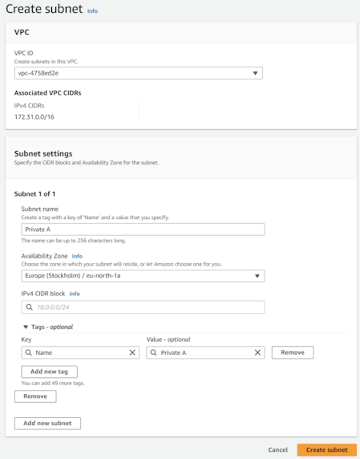

# Overview
[NAT M8](https://www.logleads.com/natm8) is an IaC source available NAT solution that radically lowers cost and in the same time improves availability of your private AWS services. 

Top five reasons to choose NAT M8 over NAT Gateway

* using Sydney region 2023 May prices a t4g.nano instance type spot purchase mode as an example, total monthly cost is 1$ and 16 cents vs AWS NAT gateway at 43 $ 7 cents that is a **staggering 97.3% cheaper**!
* using same billing parameters as before NAT Gateway has a *5.9c/GB data transfer cost*, at 1TB/month that's 59$, where as using *NAT M8 there are no data transfer costs at all*.
Note: in edge cases extra cpu utilisation cost may occur but even that would be a fraction of the standard NAT GW data processing rates.
* NAT M8 is EC2 based, EC2 service, has a [99.99% SLA](https://aws.amazon.com/compute/sla/) , NAT Gateway only has a [99.9% SLA](https://aws.amazon.com/vpc/sla/).
* In case of failure with an instance or the whole availability zone, NAT M8 has **built in automatic fail over**, in less than a minute if there is an active instance to fail over to, while with NAT Gateway you have to manually re-route traffic or wait for AWS to fix the issue either could take hours.
* NAT M8 automatically scales from 1 public / 1 private subnet arrangement to 8/8 and anything in between see a few examples below.

---
## Licence
NAT M8 licence is based on the Logverz public licence, which allows free use of the product and only places restrictions on custom private development. 
You may learn more about the license [here](https://docs.logverz.io/licence) and use cases. [here](https://www.logverz.io/pricing).

---
## Prerequsite subnet configuration
On AWS console, search for VPC and open subnets option. 
A typical new accounts networking configuration looks like this:

Take note of route table having default route (0.0.0.0/0) pointing to IGW-XXX, that is the AWS Internet Gateway. 

To start click on the Name of the first subnet and (on the right) check which Availability Zone it belongs to, than add descriptive name such as Public B, go and to the same for the other subnets. Having clearly annotated subnets will come in handy at deployment time.

If you already have private subnets, skip the next step otherwise,click Create Subnet button on the top right.

and fill the parameters like subnet name / availability zone accordingly. As for the IPv4 CIDR block
we recommend /20 mask. The values for three subnets are as follows 172.31.48/20, 172.31.64/20, 172.31.80/20.
For other options use a subnet calculator such as https://www.calculator.net/ip-subnet-calculator.html

End result should look similar to this: 

---
## Deployment 

First download NATM8.json from this repository to your machine than, open AWS console CloudFormation, click on create stack, choose upload a template file and select previously downloaded NATM8.json.

Only the first 4 parameters are require to be filled with your local setting - with properly labeled subnets that is easy - , for everything else you can keep the sensible defaults or modify according to your needs.

---
## Parameter reference 

### Virtual Private Cloud Settings
Parameters are straightforward generic network information of your environment, for further on the technology look at [AWS documentation](https://docs.aws.amazon.com/vpc/latest/userguide/what-is-amazon-vpc.html)

### Instance Generic Settings

#### Instance Type X64
EC2 instance types X64 (Intel/AMD) architecture, in format, x.<size>, y.<size>, z.<size>. Specify maximum 3 X64 types, can be empty if you only want to use ARM type instances. Make sure the instance type exists in the selected region, and that you don't accidentally mix instances with different CPU architectures, otherwise deployment will fail.

#### Instance Type ARM
EC2 instance type ARM architecture, in format, x.<size>, y.<size>, z.<size>.. Specify maximum 3 ARM types, can be empty if you only want to use X64 type instances. Make sure the instance type exists in the selected region, and that you don't accidentally mix instances with different CPU architectures, otherwise deployment will fail.

#### Instance Desired Number
The desired number of instances, if no scaleup or scaledown configured it will remain as set, otherwise raise or fall respectively

#### Instance Minimum Number
The minimum number of instances, if set to 0 and scaledown config is present than instance by **default will stop** once conditions apply (default 1MB / hour), if you want **continusly running** service set the minimum number to 1.

#### Instance Scale Up Configuration
First parameter is CPU usage percentage range of 1-100, second number of minutes, with minimum value of 5 and 1440 as max. By default if per instance AVG cpu usage exceeds 70% for 5 minutes, a new instance is scaled up until ASG max number is reached. Leave empty if no scaleup is desired.

#### Instance Scale Down Configuration
First parameter is network in traffic in MB, minimum value 1, second number of minutes, with minimum value of 5 and 1440 as max. By default if per instance network traffic usage is under 1MB for 60 minutes, the instance is scaled down until ASG minimum number is reached. Leave empty if no scaledown is desired.

### Advanced Configuration

#### CloudWatch Logs and Metrics Configuration

Contains configuration options of which logs and metrics to collect, configuration is set in SSM parameter store /NAT_M8/CloudwatchLogsConfig<type> for dev or hobbyist environment "minimal", standard environments "basic", enterprise or critical environment "standard" config is recommended. Differences are "minimal" only collect log files, "basic"  on top of minimal collects essential disk and memory metrics. Lastly "standard" extends basic with more memory and disk metrics including IO. Collected metrics are visible under All metrics, CWAgent category. Note adding extra monitoring has a per metric/host cost more on that at [CloudWatch pricing.](https://aws.amazon.com/cloudwatch/pricing/)

#### OnDemand Instance Purchase Percentage
The percentage of ondemand instances in the autoscaling group. At 0 its all spot, at 100 its all ondemand instances. Incase of 3 instances setting 33 means 1 will be ondemand and 2 will be spot purchase mode.

#### Scheduled Scale Down State
By Default scheduled scale down is disabled, if feature required:

1st step configure parameters in parameter store in keys /NAT_M8/ASGScaleDownConfig/*, where star equals
* DesiredCapacity
* MinimumCapacity
* Schedule
* TimeZone

Desired and Minimum capacity are self explanatory numerical values.

Scheduling is based on Cron syntax "0 22 * * 1-5" means At 10:00 PM, Monday through Friday, for other combinations use https://crontab.cronhub.io/.

TimeZone the default is UTC if you prefer to use another look at [AWS documentation](https://docs.aws.amazon.com/AWSCloudFormation/latest/UserGuide/aws-resource-autoscaling-scheduledaction.html#cfn-autoscaling-scheduledaction-timezone) for syntax.

2nd step after necessary parameters are configured in parameter store as par above, set this CloudFormation parameter to be enabled.

#### Scheduled Scale Up State
By Default scheduled scale up is disabled, if feature required: 

1st configure parameters in parameter store in keys /NAT_M8/ASGScaleUpConfig/*, same syntax and logic as scaledown.
2nd step after necessary parameters are configured in parameter store as par above, set this CloudFormation parameter to be enabled.

### Other Settings

#### NAT Configuration Bucket
Optional if empty the route configuration script is directly downloaded from GitHub, in case you want to source it from a local bucket than specify **only bucketname** such as *mybucket* no beginning or trailing "/".   

#### NAT Routing Logic location
Optional if empty the route configuration script is downloaded from GitHub, in case you want to source it from a local bucket (and file located in the root) specify *ConfigureRoutes.ps1*. Assuming file is located in a nested subfolder such as scripts -> nat than provide path like: *scripts/nat/ConfigureRoutes.ps1*.

In either case please **note** there is no "**/**" at the beginning of the filename.

#### Instance AMI ID X64 and Instance AMI ID ARM

These are so called[ SSM parameter type](https://docs.aws.amazon.com/AWSCloudFormation/latest/UserGuide/parameters-section-structure.html#aws-ssm-parameter-types) that [dynamically reference](https://aws.amazon.com/blogs/compute/query-for-the-latest-amazon-linux-ami-ids-using-aws-systems-manager-parameter-store/) the latest version of respective AMI ID for the region. Meaning the AMI upgrade process is as easy periodically updating the stack with a next next submit.

---
## Removing NAT M8 components 
First make sure that no instance is running and ASG is set 0/0/0.   
Second open VPC console route tables section and starting with route table named "Private route 2 NAT 1" all the way to the last one click edit subnet associations and remove associations. 
Third and last step is to go to CloudFormation and delete stack. 

